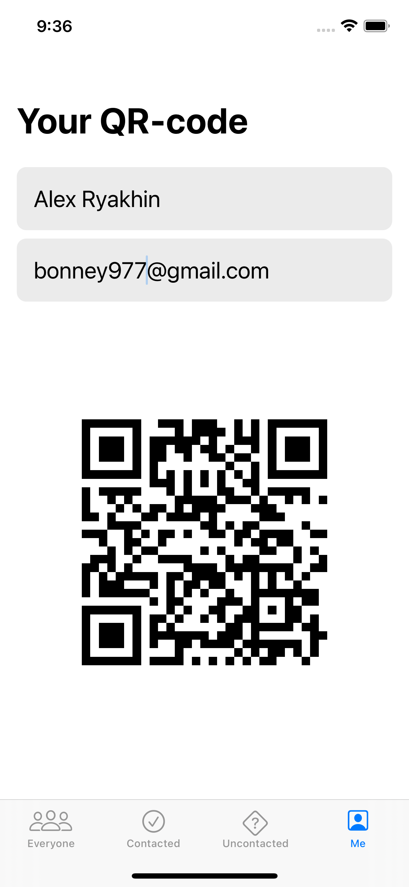

# Hot-Prospects
16th project of 100 Days of SwiftUI Cours by Paul Hudson. This app allows you to to scan a QR code (realized by added framework) and add the prospect (potential customer) to your list. You have 3 list views here: Main list with all added people, and then another two - with contacted and uncontacted people. Long press on one raw pops up a menu where you can mark selected prospec as contacted or not. Data is saving to app's document repository to JSON file. Also on the fourth view you can set up your own QR code with name and email. In addition, you also can set up a notification to contact people.

   
